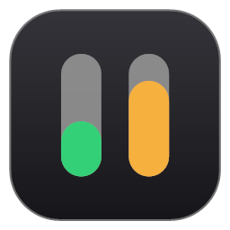
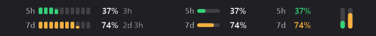
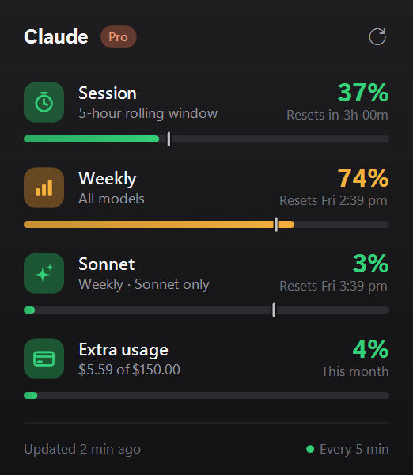
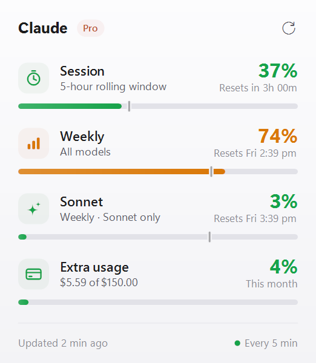

# Claude Usage Bar

Your Claude plan limits, live in the Windows taskbar. See how much of your **5-hour session** and **weekly** limit you've used without opening Claude. Click for the full breakdown.



<p>
  
  
</p>

## Features

- **Sits in the taskbar itself.** It isn't a floating window: it goes into a free gap on the taskbar and blends with its background.
- **Always finds space.** It measures the real taskbar layout and picks the largest of four sizes that fits: **Full → Compact → Mini → Micro**. As you open and close apps, it resizes and moves by itself.
- **Details popup.** Session, weekly, per-model (Sonnet/Opus) and extra-usage limits, with reset times. A small tick on each bar shows where your usage would be if spread evenly across the window, so you can tell if you're ahead or behind.
- **Colour coded:** green, then amber at 70%, then red at 90%.
- **Light and dark** themes that follow Windows.
- **Light on resources.** It checks every 5 minutes, backs off when rate limited and keeps the last reading so it shows numbers instantly on startup.

## Setup

### 1. Install Claude Code and log in

The widget reads your usage with the login from [Claude Code](https://docs.claude.com/en/docs/claude-code/setup), so you need to sign in there once.

Install it (PowerShell):

```powershell
irm https://claude.ai/install.ps1 | iex
```

Then open a terminal and run:

```powershell
claude
```

Inside Claude Code, type `/login`. Choose **Claude account with subscription** (Pro / Max / Team) and finish signing in in your browser. After that you can close the terminal.

> Already running the widget? It notices the login within a few seconds, so there's no need to restart it. If you aren't signed in, clicking the widget shows a setup card with an **Open terminal** button that does step 1 for you.

### 2. Install the widget

**Option A: download.** Get `ClaudeUsageBar.exe` from [Releases](../../releases). Save it somewhere permanent, such as `C:\Users\<you>\Apps\`, because Start with Windows points at wherever the exe is. Then run it.

Because the app is new and isn't code-signed, your browser and Windows will probably warn you the first time. That's expected. See [Getting past download and security warnings](#getting-past-download-and-security-warnings) below.

**Option B: build from source** (needs the [.NET 8 SDK](https://dotnet.microsoft.com/download/dotnet/8.0)):

```powershell
git clone https://github.com/ANGLT12345/claudestatus.git
cd claudestatus
dotnet publish -c Release -r win-x64 --self-contained false -p:PublishSingleFile=true -o dist
.\dist\ClaudeUsageBar.exe
```

### Getting past download and security warnings

The exe is new and isn't signed with a paid code-signing certificate, so Windows and browsers don't "know" it yet and warn you. This is normal for small open-source apps, and the warnings get rarer as more people download it. If you'd like to check the file first, compare its checksum with the `.sha256` file on the release page (see [Security & privacy](#security--privacy)), or build it yourself (Option B).

**Microsoft Edge: "ClaudeUsageBar.exe isn't commonly downloaded"**
1. In the downloads panel, hover over the file and click **⋯** (More actions).
2. Choose **Keep**.
3. If a second warning appears, click **Show more** → **Keep anyway**.

**Google Chrome: "Suspicious download" / "This file isn't commonly downloaded"**
1. In the downloads panel, click the warning, or open `chrome://downloads`.
2. Choose **Download suspicious file**, or **Keep**.

**Firefox** usually downloads it without asking. If it's blocked, open the downloads list (↓), right-click the file and choose **Allow download**.

**Windows: "Windows protected your PC" (Microsoft Defender SmartScreen)**
1. Click **More info**.
2. Click **Run anyway**.

You only need to do this once.

**Alternatively, unblock the file before running it:** right-click `ClaudeUsageBar.exe` → **Properties** → at the bottom of the **General** tab, tick **Unblock** → **OK**.

**"To run this application, you must install .NET"**

The app needs the free .NET 8 Desktop Runtime. Click **Yes**, download the **.NET Desktop Runtime 8 (x64)** installer, run it, then start the app again. Or install it straight from [Microsoft](https://dotnet.microsoft.com/download/dotnet/8.0).

**Smart App Control blocked it with no "Run anyway" option**

Windows 11's Smart App Control blocks unsigned apps and has no per-app exception. Your options are to build from source (Option B), or to turn Smart App Control off in **Windows Security → App & browser control → Smart App Control settings**. Be aware that on current Windows versions it can't be turned back on without resetting Windows.

**Your antivirus flags it**

Some antivirus tools are suspicious of new, unsigned apps, especially ones that read a credentials file. The app only sends your login token to Anthropic; see [Security & privacy](#security--privacy). You can check the checksum, read the source, or build it yourself. If you get a false positive, please [open an issue](../../issues) naming the antivirus product.

### 3. That's it

It starts with Windows automatically from the first launch. To turn that off, right-click the widget and untick **Start with Windows**; it stays off after that. If you move the exe, the startup entry follows it the next time you run it.

## Using it

| Action | What it does |
| --- | --- |
| **Left-click** | Opens the details popup (Esc or clicking elsewhere closes it) |
| **Right-click** | Menu: Show details, Refresh now, Size, Start with Windows, Quit |
| **F5** in the popup | Refreshes now |

**Sizes.** Auto picks one for you. To pin a size, right-click and choose **Size**.

| Size | Shows |
| --- | --- |
| Full | Segmented bars, % and time until reset |
| Compact | Thin bars and % |
| Mini | % only (coloured by status) |
| Micro | Two tiny vertical gauges (5h, 7d) |

On a centred taskbar it prefers the empty space left of your apps, next to Widgets, because that spot doesn't move as apps open and close. If there isn't room, it uses the gap next to the tray. If no size fits anywhere, it squeezes Micro into the biggest gap.

## Troubleshooting

- **"Set up" / "Sign in" on the taskbar.** No valid Claude Code login was found. Do step 1 above, or click the widget and use **Open terminal**.
- **"Rate limited".** Anthropic's usage endpoint limits how often it can be called. The widget waits for the time the server asks for and then retries.
- **The widget disappeared after Explorer restarted.** It re-attaches automatically within a second or two. If it doesn't, restart the app.
- **Custom Claude config folder.** If you set `CLAUDE_CONFIG_DIR`, the widget uses it too.

## Security & privacy

- **No telemetry.** The app makes one kind of network request: `GET https://api.anthropic.com/api/oauth/usage`, the same endpoint behind Claude Code's `/usage` command. It's undocumented and could change.
- **Your login token stays put.** It's read from Claude Code's `~/.claude/.credentials.json` and sent only to that address, over HTTPS. Redirects are refused, so the token can never be forwarded to another host. The app never copies the token, logs it, caches it or displays it, and never writes to your credentials file.
- **What's stored.** The last usage numbers (percentages and reset times, no token) go in `%LOCALAPPDATA%\ClaudeUsageBar\last.json`. Settings go in `HKCU\Software\ClaudeUsageBar`, and the optional autostart entry in `HKCU\...\Run`. No admin rights are needed.
- **What it runs.** Only when you click **Open terminal** in the setup card, it launches `claude` from an absolute PATH entry or from `%USERPROFILE%\.local\bin`.
- **No third-party packages.** It uses only .NET and Windows APIs.
- **Verifiable releases.** Release builds are produced by [GitHub Actions](.github/workflows/release.yml) from the tagged source, with a `.sha256` checksum next to the exe. To check a download:
  ```powershell
  (Get-FileHash .\ClaudeUsageBar.exe -Algorithm SHA256).Hash
  ```
- Found a security problem? Please see [SECURITY.md](SECURITY.md).
- Full details: [Privacy statement](PRIVACY.md).

## How it works

- The taskbar strip is a layered child window placed inside `Shell_TrayWnd`. It finds free space by reading the real button positions through UI Automation, because on Windows 11 the older taskbar window bounds are out of date.
- It checks every 5 minutes and follows the server's `Retry-After` when rate limited. Once a token has been rejected, it stops calling the API until Claude Code writes a new one.

## Development

```powershell
dotnet build
dotnet run                               # run it
dotnet run -- --render docs              # re-render the README screenshots with sample data
dotnet run -- --icon app.ico             # regenerate the app icon
```

| File | Purpose |
| --- | --- |
| `StripPainter.cs` | Draws the four taskbar sizes |
| `Strip.cs` | Taskbar embedding, placement, mouse input |
| `TaskbarLayout.cs` | Finds free taskbar gaps via UI Automation |
| `Popup.cs` | Details popup and setup card |
| `Usage.cs` | API client, parsing, cache, formatting |
| `AppController.cs` | Polling, backoff, menus, startup |

### Releasing

Push a version tag and GitHub Actions builds the exe and attaches it (with its checksum) to a new Release:

```powershell
git tag v1.0.0
git push origin v1.0.0
```
---

Not affiliated with or endorsed by Anthropic. "Claude" is a trademark of Anthropic.
